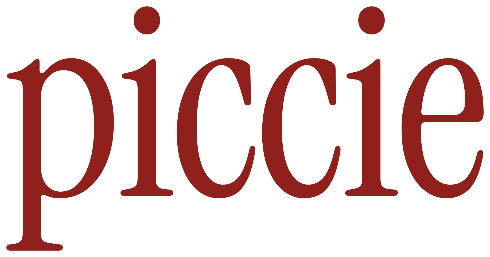
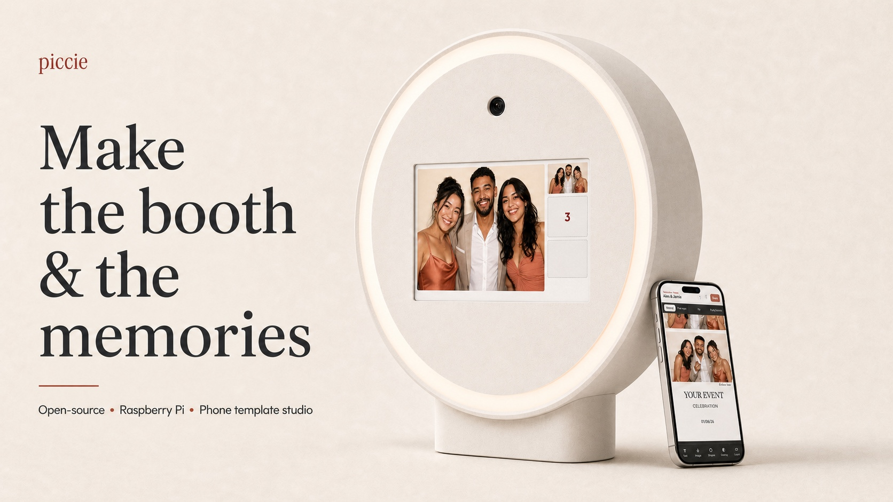
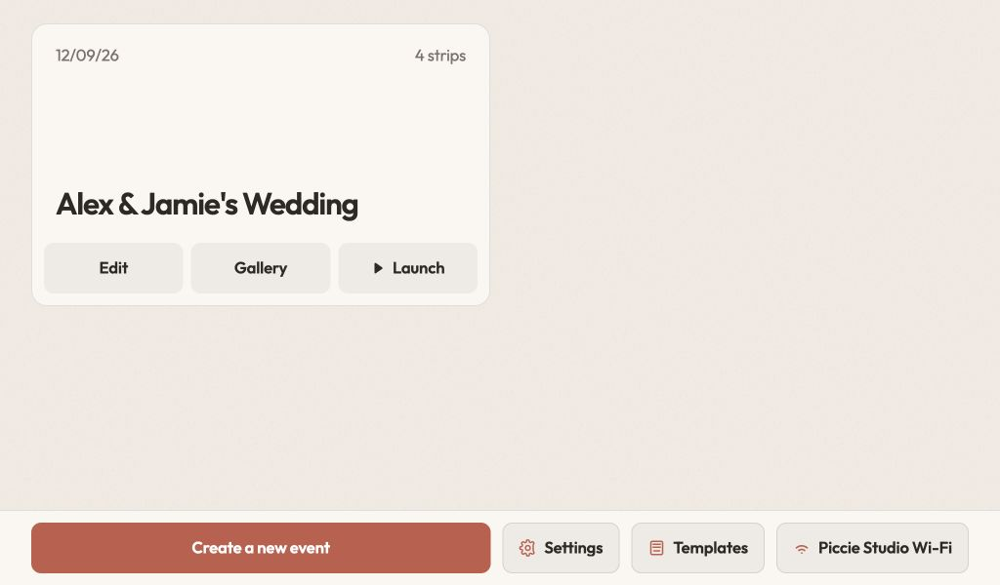
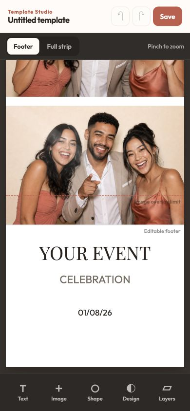
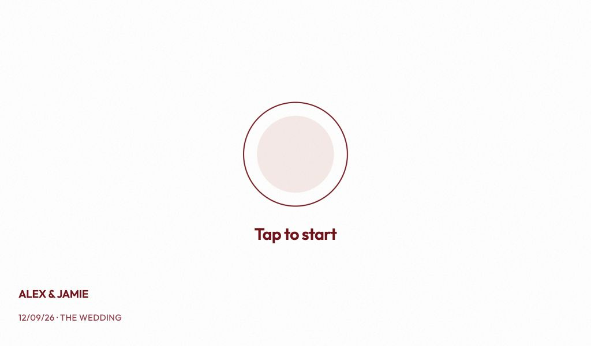
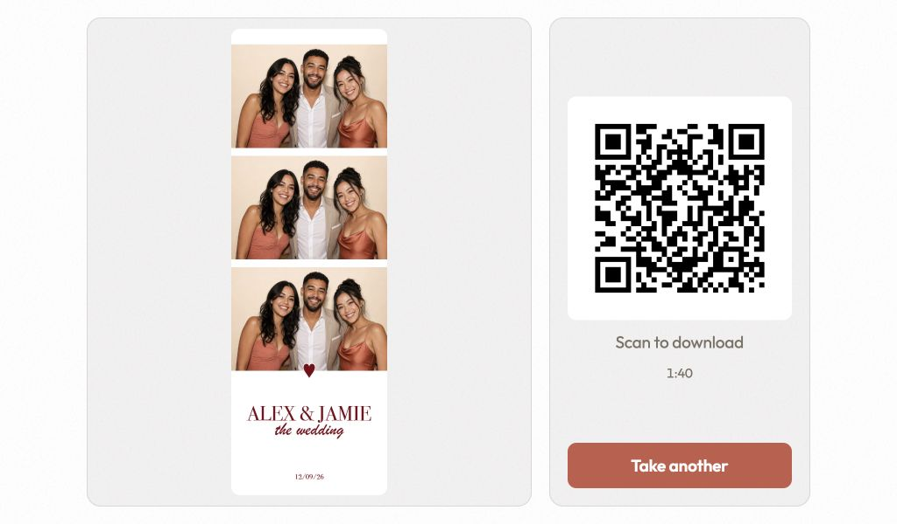

  

<strong>Make the booth &amp; the memories</strong>

Piccie combines a Raspberry Pi, touchscreen, camera and printed enclosure into
a self-contained photobooth. Guests take three photos and scan a QR code to
download their strip. Organisers create events, manage galleries and design
templates from a phone connected to the same Wi-Fi.

Piccie is self-hosted. The booth stores its own data and uploads finished strips
to your Cloudflare R2 account.

## Get started

Choose the guide you need:

1. **[Set up the software](docs/software-setup.md)** — download the ready-made
   image, or build it yourself on macOS, Linux or Windows. Then flash the
   microSD card, complete first boot and run the reliability test.
2. **[Build the hardware](docs/hardware.md)** — see the current parts list and
   printed components. STL files and full assembly instructions are coming
   soon.

## Piccie in action

| Booth admin | Phone template studio |
| --- | --- |
|  |  |

| Start a session | Take photos | Download the strip |
| --- | --- | --- |
|  |  |  |

## Project status

The software is usable and tested on the Raspberry Pi 4 Model B reference
booth. The hardware release is not complete: STL files, final fastener
quantities and photographed assembly instructions still need to be published.

For development and contribution instructions, read
[CONTRIBUTING.md](CONTRIBUTING.md). Piccie is released under the MIT licence;
third-party font licensing is recorded in
[THIRD_PARTY_NOTICES.md](THIRD_PARTY_NOTICES.md).
