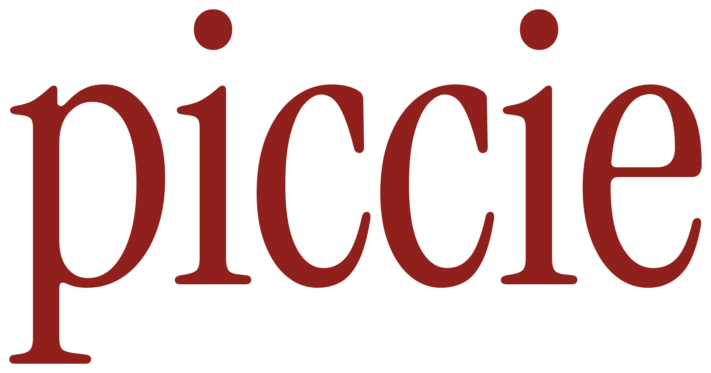
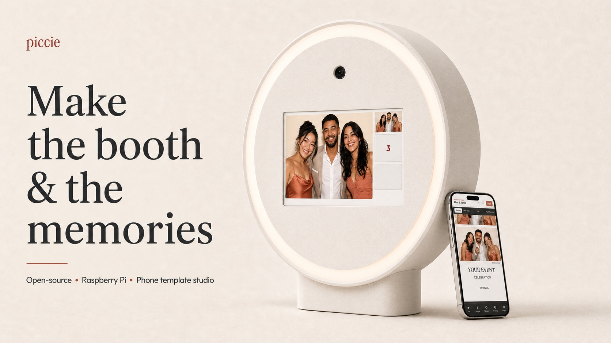
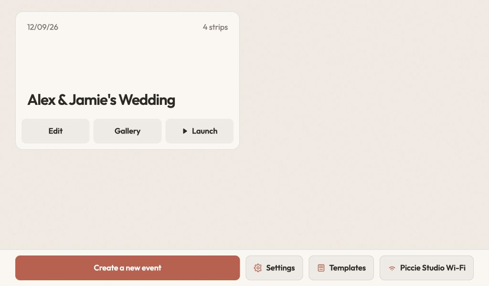
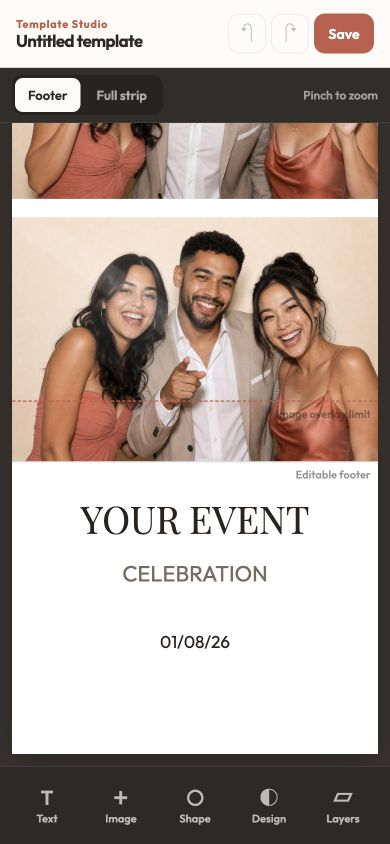
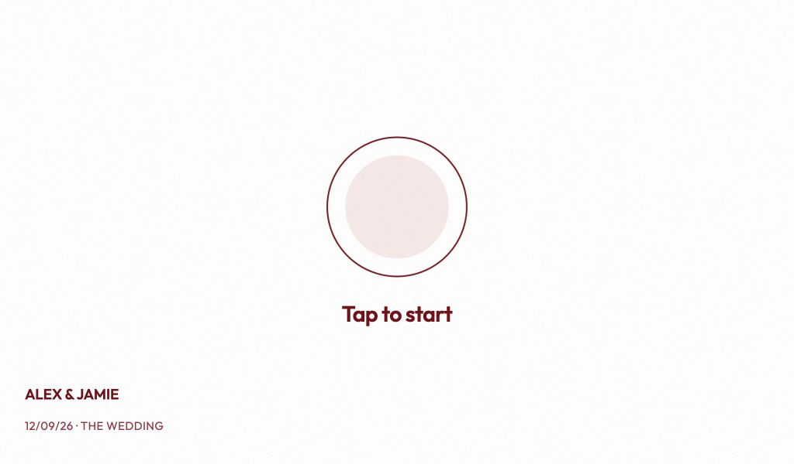
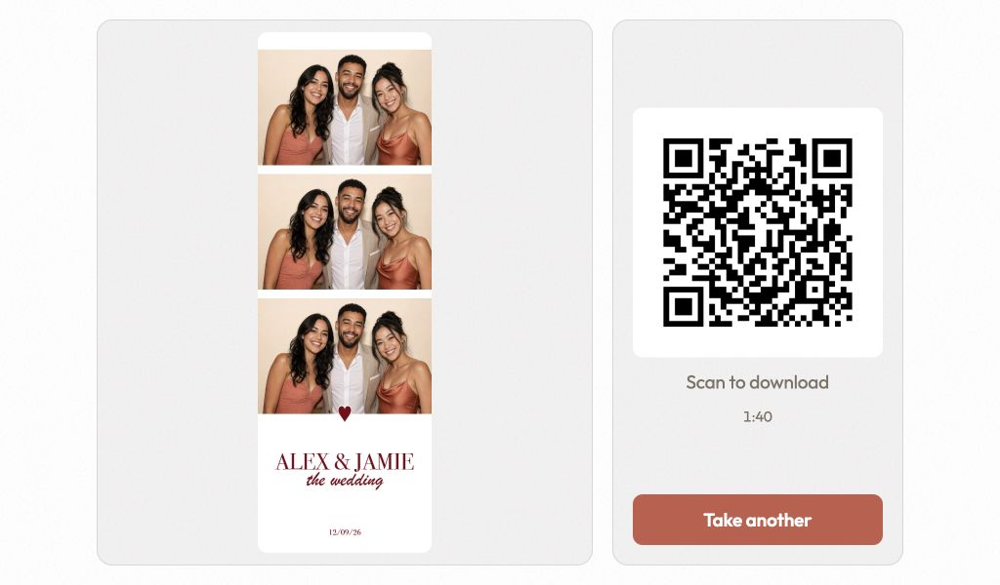

  

<strong>Make the booth &amp; the memories</strong>

Piccie combines a Raspberry Pi, touchscreen, camera and printed enclosure into
a self-contained photobooth. Guests take three photos and scan a QR code to
download their strip. Organisers create events, manage galleries and design
templates from a phone connected to the same Wi-Fi.

Piccie is self-hosted. The booth stores its own data and uploads finished strips
directly to a private bucket in your Cloudflare R2 account. After flashing the
image—and before the first boot—you must complete `piccie-r2.txt` with your R2
credentials and copy it to the top level of the microSD card's boot drive.
Piccie imports it once and creates seven-day signed guest links without a
Worker, OAuth client, GitHub connection or public bucket. Wi-Fi is configured
separately on Piccie's touchscreen during first-time setup.

R2 media is organised by event name and date. For example, an event named
“Sarah & James” on 14 June 2026 uses `sarah-james-2026-06-14/`, with finished
strips under `strips/` and the three original captures under `photos/`. Strip
numbers are permanent five-digit identifiers such as
`sarah-james-strip-00001.jpg`. From the event gallery, **Share event** displays
a QR code whose **Download all photos** action transfers one ZIP containing
both folders.

## Before the first boot

1. Flash the Piccie image with Raspberry Pi Imager and skip its operating-system
   customisation options.
2. Reinsert the microSD card into your computer and open its visible boot drive.
3. Complete the included `piccie-r2.txt` template with your Cloudflare R2
   credentials and, optionally, your computer's SSH public key—or copy a
   previously completed file onto the boot drive. The filename must remain
   exactly `piccie-r2.txt`. Never put an SSH private key in this file.
4. Safely eject the card and boot Piccie. Choose the Wi-Fi network and enter its
   password on the Piccie touchscreen; Wi-Fi details do not belong in the R2
   file.

The four-digit operator PIN and SSH public key can both be changed later under **Settings
→ Operator access**.

## Get started

Choose the guide you need:

1. **[Set up the software](docs/software-setup.md)** — download the ready-made
   image, or build it yourself on macOS, Linux or Windows. Then flash the
   microSD card, add the required R2 file, complete Wi-Fi setup on Piccie and
   run the reliability test.
2. **[Build the hardware](docs/hardware.md)** — see the current parts list and
   printed components. STL files and full assembly instructions are coming
   soon.

## Piccie in action

| Booth admin | Phone template studio |
| --- | --- |
|  |  |

| Start a session | Take photos | Download the strip |
| --- | --- | --- |
|  |  |  |

## Project status

The software is usable and tested on the Raspberry Pi 4 Model B reference
booth. The hardware release is not complete: STL files, final fastener
quantities and photographed assembly instructions still need to be published.

For development and contribution instructions, read
[CONTRIBUTING.md](CONTRIBUTING.md). Piccie is released under the MIT licence;
third-party font licensing is recorded in
[THIRD_PARTY_NOTICES.md](THIRD_PARTY_NOTICES.md).
